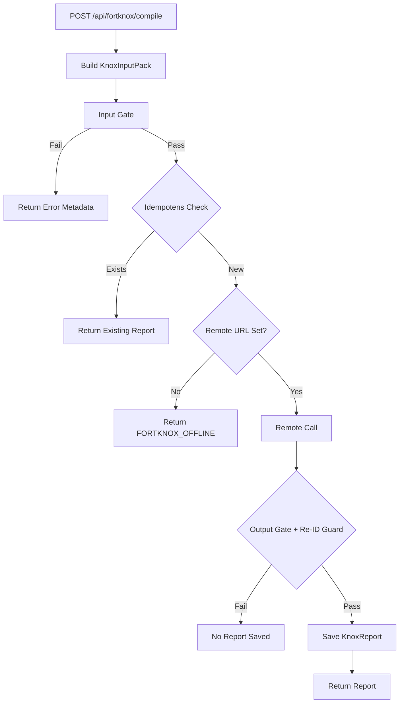

ARCHIVED: replaced by docs/ARCHITECTURE.md, docs/FLOWS.md, docs/VERIFYING.md

# Fort Knox v1 Implementation Plan (Uppdaterad)

## Översikt

Implementera Fort Knox som en säker sammanställningskammare där projekt exporteras som deterministiska `KnoxInputPack` (endast sanitiserad text), skickas till lokal LLM på Mac via privat nätverk, och rapporter genereras med strikt fail-closed policy.

## Uppdaterad Arkitektur (med justeringar)

```
Project → KnoxInputPack (deterministiskt) → Input Gate → Idempotens Check → Remote URL Check → Remote Call → Output Gate + Re-ID Guard → KnoxReport
```

**Viktig justering:** Idempotens-check sker **efter** input gate men **före** remote URL-check. Om rapport redan finns returneras den direkt, även om Fort Knox är offline.

### Komponenter

1. **KnoxInputPack Builder** - Bygger deterministiskt pack från projekt (documents + notes + sources)
2. **Input Gate** - Validerar sanitize_level och pii_gate_check innan export
3. **Idempotens Check** - Kollar om rapport redan finns (innan remote URL-check)
4. **Remote URL Check** - Om FORTKNOX_REMOTE_URL saknas/empty → FORTKNOX_OFFLINE error
5. **Remote Call** - POST till Fort Knox Local på Mac (optional env var)
6. **Output Gate + Re-ID Guard** - Validerar JSON response och kör re-identifieringscheck (n-gram match)
7. **KnoxReport Model** - Sparar rapporter med idempotens (one-per-fingerprint-per-policy+template)

## Uppdaterat Dataflöde



## Implementationssteg

### 1. Database Model - KnoxReport

**Fil:** `apps/api/models.py`

Lägg till `KnoxReport` model med fält:

- `id`, `project_id`, `policy_id`, `policy_version`, `ruleset_hash`, `template_id`
- `engine_id`, `input_fingerprint`, `input_manifest` (JSON, utan innehåll)
- `gate_results` (JSON: input/output pass/fail + reasons)
- `rendered_markdown` (Text, nullable - endast vid pass)
- `created_at`, `latency_ms`

**Index:** `(project_id, policy_id, template_id, input_fingerprint)` för idempotenslookup

### 2. Schemas

**Fil:** `apps/api/schemas.py`

Skapa schemas:

- `KnoxPolicy` (internal/external, sanitize_min_level, quote_limit_words, date_strictness, max_bytes, version, ruleset_hash)
- `KnoxInputPack` (project metadata, documents[], notes[], sources[], policy, template_id, input_manifest, input_fingerprint)
- `KnoxCompileRequest` (project_id, policy_id, template_id)
- `KnoxReportResponse` (report metadata + rendered_markdown)
- `KnoxErrorResponse` (error_code, reasons[], detail?) - metadata-only error format
- `KnoxLLMResponse` (JSON Schema med additionalProperties:false):
  - `template_id`, `language: "sv"`, `title`, `executive_summary`
  - `themes[{name, bullets[]}]`, `timeline_high_level: string[]`
  - `risks[{risk, mitigation}]`, `open_questions: string[]`, `next_steps: string[]`
  - `confidence: "low"|"medium"|"high"`

### 3. Fort Knox Core Logic

**Fil:** `apps/api/fortknox.py` (ny)

Funktioner:

- `build_knox_input_pack(project_id, policy_id, template_id, db)` → `KnoxInputPack`
  - Hämtar projekt, documents (sorterat: created_at asc, id asc), notes (sorterat: created_at asc, id asc), sources (sorterat: type asc, id asc)
  - **Document hash:** Använd `document.sha256` om fält finns, annars beräkna `sha256(document.masked_text)` i runtime
  - Beräknar sha256 för varje note.masked_body i runtime (endast hashen i manifest, inte texten)
  - Bygger input_manifest (utan innehåll, endast metadata + hash):
    - documents: `{kind:"document", id:doc_id, sha256, sanitize_level, updated_at}`
    - notes: `{kind:"note", id:note_id, sha256, sanitize_level, updated_at}`
    - sources: `{kind:"source", id:source_id, url_hash, updated_at}`
  - Bygger input_fingerprint = sha256(canonical_json(input_manifest))
  - **canonical_json:** `json.dumps(manifest, sort_keys=True, separators=(',',':'), ensure_ascii=False)`
  - Listordning stabiliseras via deterministisk sortering i pack-building

- `input_gate(pack, policy)` → `(pass: bool, reasons: list)`
  - Kollar sanitize_level >= policy.sanitize_min_level (docs + notes)
  - Kör pii_gate_check på sammanfogad sanitized payload (documents + notes)
  - Kollar pack_size <= policy.max_bytes
  - Fail-closed: returnerar (False, reasons)

- `re_id_guard(rendered_text, input_texts, policy)` → `(pass: bool, reasons: list)`
  - **N-gram match implementation:**
    - Normalisera input och output: lowercase + whitespace-normalisering (replace whitespace sequences med single space)
    - Skapa n-grams från input_texts med längd = quote_limit_words + 1
    - Kolla om någon n-gram-sekvens från input finns i output
    - Om match hittas → fail (reasons.append("quote_detected"))
  - External policy: inga exakta datum, inga identifierande kombinationer (heuristik)
  - Fail-closed: returnerar (False, reasons)

- `render_markdown(llm_json, template_id)` → `str`
  - Deterministisk rendering från JSON till Markdown (kod)
  - Template_id påverkar inte strukturen, endast styling/formatting

### 4. Remote Call Module

**Fil:** `apps/api/fortknox_remote.py` (ny)

Funktion:

- `compile_remote(pack, policy, template_id, remote_url, test_mode=False)` → `KnoxLLMResponse`
  - **FORTKNOX_TESTMODE:** Om `FORTKNOX_TESTMODE=1` → använd fasta JSON fixtures (internal pass fixture + external fail fixture) istället för remote-call
  - POST till `{remote_url}/compile` med timeout (30s) (endast om inte test_mode)
  - **Payload (v1):** policy metadata, template_id, input_fingerprint, documents[], notes[]
    - **Exkludera sources från payload** (eller max `{type, title}` utan url)
    - Manifest kan fortsatt innehålla url_hash, men payload ska inte innehålla url
  - Validerar JSON response mot schema (additionalProperties:false)
  - Loggar aldrig text, bara metadata (policy_id, template_id, input_fingerprint)
  - Fail-closed vid timeout/network error/schema validation error
  - Raises exception med error_code och reasons

### 5. API Endpoint

**Fil:** `apps/api/main.py`

Endpoint: `POST /api/fortknox/compile`

- Tar `KnoxCompileRequest`
- Bygger pack → Input gate → **Idempotens check** → Remote URL check → Remote call → Output gate + Re-ID guard → Spara report
- **Idempotens check:** Kolla om `(project_id, policy_id, template_id, input_fingerprint)` redan finns
  - Om ja → returnera befintlig report (även om FORTKNOX_REMOTE_URL saknas)
- **Remote URL check:** Om FORTKNOX_REMOTE_URL saknas/empty → returnera FORTKNOX_OFFLINE error (metadata-only)
- **Error responses:** Standardiserat format `{error_code: str, reasons: list, detail?: str}` (metadata-only)
  - error_codes: `FORTKNOX_OFFLINE`, `INPUT_GATE_FAILED`, `OUTPUT_GATE_FAILED`, `REMOTE_ERROR`, etc.
- Returnerar `KnoxReportResponse` eller `KnoxErrorResponse`

### 6. Verifieringsscript

**Fil:** `apps/api/_verify/verify_fortknox_v1.py` (ny)

**Deterministisk verifiering:** Använd `FORTKNOX_TESTMODE=1` där remote-call ersätts av fasta JSON fixtures:
- **Internal pass fixture:** Validerad JSON response som passar output gate + re-ID guard
- **External fail fixture:** JSON response som triggar quote_detected och/eller date-strictness failures
- Fixtures ska ligga i `tests/fixtures/fortknox/` eller inline i verify-scriptet

Testar:

1. Skapa projekt + docs + notes
2. Compile internal (med TESTMODE) → PASS (assert: policy_version, ruleset_hash, input_fingerprint, manifest ok)
3. Compile external (med TESTMODE, fail fixture) → FAIL deterministiskt (output gate fail: quote_detected/date-strictness)
4. Compile internal igen utan ändringar → dedupe (skipped/returned existing, samma fingerprint)
5. Testa FORTKNOX_REMOTE_URL missing → FORTKNOX_OFFLINE error (metadata-only)
6. Verifiera idempotens även när remote är offline (rapport returneras om den finns)

**Output:** `apps/api/test_results/fortknox_v1_verify.json`

**Path:** Använd samma mönster som andra verify-scripts:

```python
TEST_RESULTS_DIR = Path(__file__).parent.parent / "test_results"
TEST_RESULTS_DIR.mkdir(exist_ok=True)
```

### 7. Makefile

**Fil:** `Makefile`

Lägg till target:

```makefile
verify-fortknox-v1:
	@echo "=== Fort Knox v1 Verification ==="
	@docker-compose exec -T -e FORTKNOX_TESTMODE=1 api python3 /app/_verify/verify_fortknox_v1.py || \
		(echo "Note: If containers are not running, start with 'make dev' first" && exit 1)
	@echo ""
	@echo "Results: apps/api/test_results/fortknox_v1_verify.json"
```

### 8. Environment Variables

**Fil:** `docker-compose.yml`

Lägg till i api service environment:

```yaml
FORTKNOX_REMOTE_URL: ${FORTKNOX_REMOTE_URL:-}
FORTKNOX_TESTMODE: ${FORTKNOX_TESTMODE:-0}
```

**FORTKNOX_TESTMODE:** Sätt till `1` för deterministisk verifiering med fasta JSON fixtures (ingen remote-call)

## Säkerhet och Fail-Closed

1. **Input Gate:** Sanitize level check + PII gate check + size check
2. **Idempotens:** Kolla före remote URL-check (rapport returneras även om remote offline)
3. **Remote URL Check:** Om saknas/empty → FORTKNOX_OFFLINE (metadata-only error)
4. **Output Gate:** JSON schema validation + PII gate check + Re-ID guard (n-gram match)
5. **Logging:** Aldrig textinnehåll, endast metadata (report_id, policy_id, fingerprint, gate results)

## Idempotens (uppdaterad ordning)

One-report-per-fingerprint-per-policy+template:

- **Kolla efter input gate** om `(project_id, policy_id, template_id, input_fingerprint)` redan finns
- Om ja → returnera befintlig report (skippa remote URL-check och remote call)
- Om nej → fortsätt med remote URL-check och remote call

## Canonical JSON för Fingerprint

- **Format:** `json.dumps(manifest, sort_keys=True, separators=(',',':'), ensure_ascii=False)`
- **Manifest:** Lista med dicts (documents, notes, sources) sorterad deterministiskt
- **Listordning:** Stabiliseras via deterministisk sortering i pack-building (created_at asc, id asc för docs/notes, type asc, id asc för sources)

## Document Hash

- **Använd `document.sha256` om fält finns i modellen**, annars beräkna `sha256(document.masked_text)` i runtime
- Använd hashen i manifest: `{kind:"document", id:doc_id, sha256, sanitize_level, updated_at}`

## Notes Hash

- Beräkna `sha256(note.masked_body)` i runtime
- Använd endast hashen i manifest: `{kind:"note", id:note_id, sha256, sanitize_level, updated_at}`
- Masked_body finns i pack för remote-call, men inte i manifest

## Remote Payload (v1)

- **Payload innehåller endast documents + notes** (exkludera sources från payload)
- Sources kan inkluderas som metadata om nödvändigt: max `{type, title}` utan url
- Manifest kan fortsatt innehålla url_hash för sources, men payload ska inte innehålla url

## Re-ID Guard (N-gram Match)

- **Normalisering:** lowercase + whitespace-normalisering (replace whitespace sequences med single space)
- **N-gram creation:** Skapa n-grams från input_texts med längd = quote_limit_words + 1
- **Match check:** Kolla om någon n-gram-sekvens från input finns i output (deterministisk)
- **Fail condition:** Om match hittas → fail med reason "quote_detected"

## Standardiserade Error Responses

Alla errors returneras som metadata-only JSON:

```json
{
  "error_code": "FORTKNOX_OFFLINE" | "INPUT_GATE_FAILED" | "OUTPUT_GATE_FAILED" | "REMOTE_ERROR",
  "reasons": ["reason1", "reason2"],
  "detail": "Optional detail string"
}
```

## Filer som ska ändras/skapas

- `apps/api/models.py` - Lägg till KnoxReport model
- `apps/api/schemas.py` - Lägg till Fort Knox schemas (inkl. KnoxErrorResponse)
- `apps/api/fortknox.py` - Ny fil (core logic med canonical_json, n-gram re-ID guard)
- `apps/api/fortknox_remote.py` - Ny fil (remote call)
- `apps/api/main.py` - Lägg till compile endpoint (med uppdaterad ordning: idempotens före remote URL-check)
- `apps/api/_verify/verify_fortknox_v1.py` - Ny fil (verifiering med idempotens-test)
- `Makefile` - Lägg till verify-fortknox-v1 target
- `docker-compose.yml` - Lägg till FORTKNOX_REMOTE_URL env var

## Test Mode (FORTKNOX_TESTMODE=1)

- **Deterministisk verifiering:** Remote-call ersätts av fasta JSON fixtures
- **Internal pass fixture:** Validerad JSON response som passar alla gates
- **External fail fixture:** JSON response som triggar quote_detected och/eller date-strictness
- Används endast i verify-script för att undvika flakiga tester mot riktig LLM
- Test mode kollar `os.getenv("FORTKNOX_TESTMODE", "0") == "1"`

## Noteringar

- UI implementeras INTE i v1 (endast backend)
- Template_id påverkar instruktioner/prompt, inte JSON-strukturen
- Alla fel är fail-closed (ingen rapport skapas vid fail)
- Logging är metadata-only (aldrig textinnehåll)
- Idempotens-check sker före remote URL-check (rapport returneras även om remote offline)
- Canonical JSON använder sort_keys=True, separators=(',',':')
- Document hash: använd document.sha256 om fält finns, annars beräkna sha256(document.masked_text)
- Notes hash beräknas i runtime, endast hashen i manifest
- Remote payload (v1): endast documents + notes, exkludera sources (eller max {type,title} utan url)
- timeline_high_level är string[] (inte string)
- Re-ID guard använder deterministisk n-gram match
- Error responses är standardiserade (error_code, reasons[], detail?)
- test_results path: `apps/api/test_results/`
- FORTKNOX_TESTMODE=1 för deterministisk verifiering med fixtures
